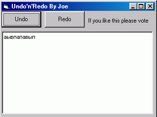



## A simple and complete Undo'n'Redo with no limit of steps

### Description

First of all this code is very simple, just ideal for beginer users, but anyone can use it. This code is used for undo and redo functions for a simple TextBox or RichTextBox
 
### More Info
 
No side effects so far

             |
---                |---
**Submitted On**   |2003-09-05 05:55:02
**By**             |[Joe Igorevitch Pritoulski](https://github.com/Planet-Source-Code/PSCIndex/blob/master/ByAuthor/joe-igorevitch-pritoulski.md)
**Level**          |Beginner
**User Rating**    |4.0 (20 globes from 5 users)
**Compatibility**  |VB 6\.0
**Category**       |[Miscellaneous](https://github.com/Planet-Source-Code/PSCIndex/blob/master/ByCategory/miscellaneous__1-1.md)
**World**          |[Visual Basic](https://github.com/Planet-Source-Code/PSCIndex/blob/master/ByWorld/visual-basic.md)
**Archive File**   |[A\_simple\_a164128952003\.zip](https://github.com/Planet-Source-Code/joe-igorevitch-pritoulski-a-simple-and-complete-undo-n-redo-with-no-limit-of-steps__1-48274/archive/master.zip)

